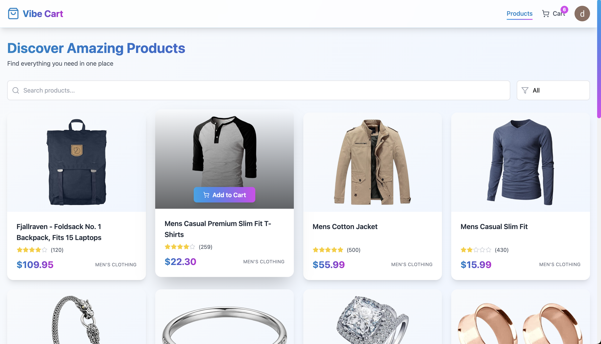
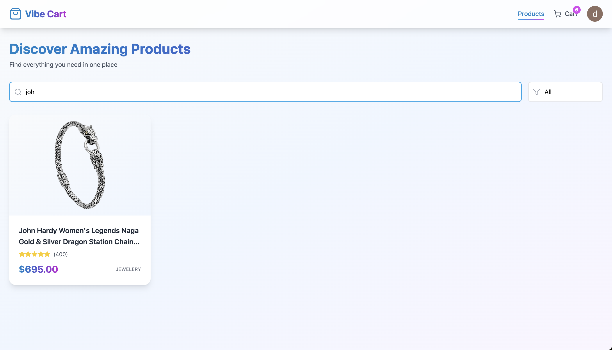
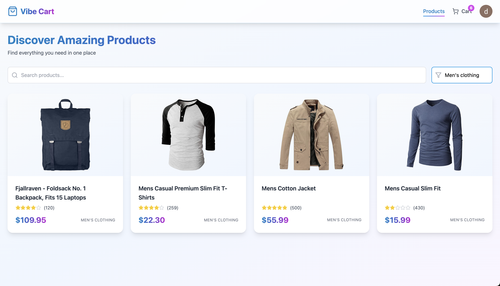
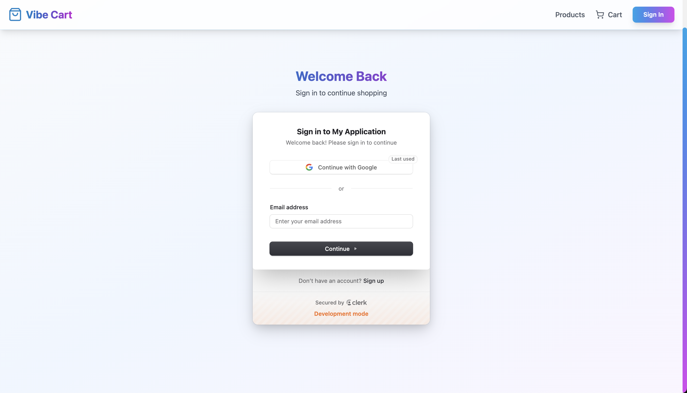
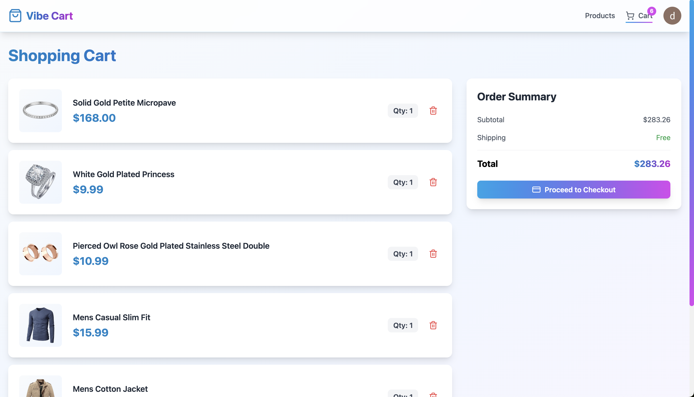
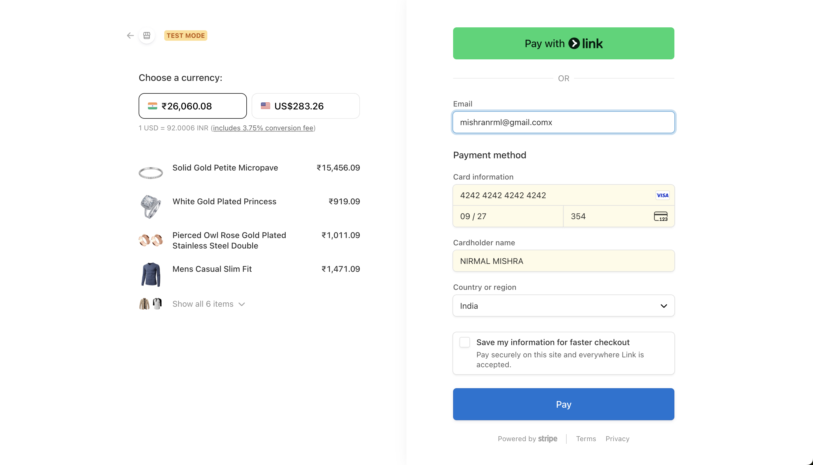
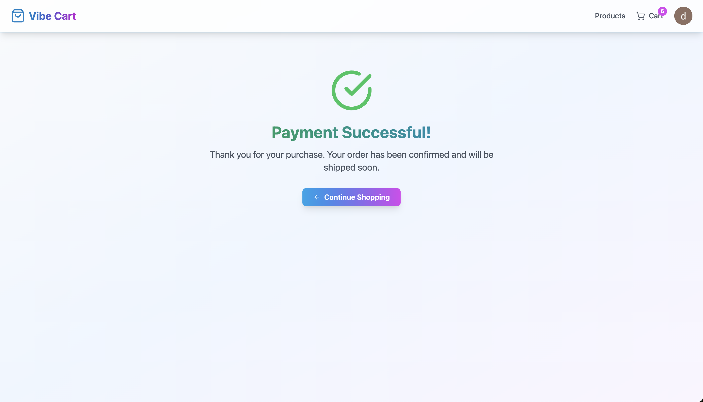

## 🎥 Demo Video

click the thumbnail below to play directly 👇  

[](https://www.youtube.com/watch?v=j1ToSX_OIDc)

## 📸 Screenshots

### Home Page  


### Search Item Page  


### Filter Page  


### Sign In Page  


### Checkout Page  


### Payment Page  


### Success Page  



# 🛒 VibeCart — MERN Stack E-Commerce App with Clerk Authentication & Stripe Payments

VibeCart is a modern, full-stack e-commerce web app built using the **MERN stack** (MongoDB, Express, React, Node.js) with **Clerk** for authentication and **Stripe** for secure online payments.  
The project demonstrates how to build a real-world shopping experience with protected routes, a cart system, and a complete checkout flow.

---

## 🚀 Features

- 🧑‍💻 **User Authentication** — Sign up and Sign in using Clerk (OAuth, Email, Google)
- 🛍️ **Product Listing** — Fetches live products from FakeStore API
- 🛒 **Cart Management** — Add, update, and remove items from cart (stored in MongoDB)
- 💳 **Stripe Checkout** — Secure payment and success/cancel pages
- 🧠 **Protected Routes** — Cart and Checkout APIs are protected using Clerk middleware
- 🌐 **Full Deployment Ready** — Works both locally and on platforms like Render / Vercel

---

## 🧩 Tech Stack

| Layer | Technology |
|--------|-------------|
| Frontend | React + Vite + Tailwind CSS + Clerk React |
| Backend | Node.js + Express.js + MongoDB |
| Auth | Clerk |
| Payments | Stripe |
| Hosting | Render (Backend) & Vercel (Frontend) |

---

## ⚙️ Installation

### 1️⃣ Clone the Repository
```bash
git clone https://github.com/your-username/vibecart.git
cd vibecart


2️⃣ Backend Setup
cd backend
npm install


Create a .env file inside backend/ with:

PORT=8000
MONGO_URI=your_mongodb_connection_string
CLERK_SECRET_KEY=your_clerk_secret_key
STRIPE_SECRET_KEY=your_stripe_secret_key
FRONTEND_URL=http://localhost:5173

Then start the backend:

npm run dev


3️⃣ Frontend Setup
cd frontend
npm install


Create a .env file inside frontend/ with:

VITE_CLERK_PUBLISHABLE_KEY=your_clerk_publishable_key
VITE_BACKEND_URL=http://localhost:8000


Run the frontend:

npm run dev

🧾 API Endpoints
Route	Method	Description	Protected
/api/products	GET	Fetch products from FakeStore API	❌
/api/cart	GET/POST/DELETE	Manage cart items	✅ Clerk
/api/checkout	POST	Create Stripe checkout session	✅ Clerk
